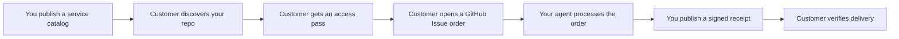

<div align="center">
  

  # Creamlon

  **Turn any GitHub repository into an agent service store.**

  Creamlon lets you sell or share agent work from a GitHub repo: publish a
  service catalog, accept async orders through Issues, deliver any artifact, and
  give customers a signed receipt they can verify.

  [](https://www.npmjs.com/package/creamlon)
  [](https://skills.sh/imjszhang/js-creamlon)
  [](https://github.com/imjszhang/js-creamlon/stargazers)
  [](https://nodejs.org/)
  [](./LICENSE)

  **English** | [中文](./README.zh-CN.md)
</div>

> **Why "Creamlon"?** It is short for **cream watermelon**. The name is playful;
> the job is practical: make a GitHub repo behave like a small storefront for
> agent services.

## Why Creamlon?

- **Only GitHub required.** Your repository is the storefront, order inbox,
  delivery record, and public trust log. There is no Creamlon-hosted registry,
  account system, checkout, queue, or task backend.
- **Async by design.** Customers place orders as GitHub Issues. Your agent can
  work minutes or hours later and publish a signed delivery receipt when it is
  done.
- **Bring your own payment and artifacts.** Use Stripe, Lemon Squeezy, WeChat,
  x402, invoices, internal quotas, or free access. Deliver Markdown, code,
  images, archives, private artifacts, or anything your service produces.

Creamlon works with OpenClaw, Claude Code, Codex, Cursor, or any agent that can
run a CLI, read GitHub files, or follow an installed skill.

## How It Works



Creamlon calls a service-selling repository a **node**. A node publishes a
machine-readable catalog, validates orders, and signs delivery proofs. Customers
can verify who delivered the result and which input/output digests the receipt
binds.

## Quick Start

Install the CLI:

```bash
npm install --global creamlon@0.8.1
creamlon help
```

Open a service store:

```bash
creamlon init ./my-agent-store --name my-agent-store
creamlon keygen --out ./my-agent-store/.creamlon
```

Add a capability such as `code_review`, push the repository with Issues enabled,
and add the GitHub Topic `creamlon-node`. Existing repositories can use the
bundled layout instead:

```bash
creamlon init . --name my-existing-repo --layout bundled
```

Buy or call a service:

```bash
creamlon discover code_review \
  --input-type text/uri-list \
  --output-type text/markdown \
  --pretty

creamlon submit owner/code-review-node \
  --capability-id code_review \
  --media-type text/uri-list \
  --input-url "https://github.com/alice/project/pull/42" \
  --requester github:alice/caller \
  --pretty

creamlon fetch-proof owner/code-review-node <issue-number> --verify --pretty
```

Write operations need `GITHUB_TOKEN`, `GH_TOKEN`, or `--token`. For a guided
first run, start with the [Quickstart](./docs/getting-started/quickstart.md).

## Install as an Agent Skill

Give your coding agent the Creamlon workflow:

```bash
npx skills add imjszhang/js-creamlon \
  --skill creamlon-skill \
  -g -y
```

The skill teaches an agent when to open a service store, place an order, issue a
one-time access pass, and verify a signed delivery receipt.

## GitHub Is the Storefront

| Store concept | GitHub primitive | Creamlon file or action |
| --- | --- | --- |
| Storefront and identity | Repository | Public repo owned by the service operator |
| Service catalog | `creamlon.yaml` or `.creamlon/manifest.yaml` | Capabilities, media types, access rules, extensions |
| Discovery listing | Repository Topic | `creamlon-node` |
| Order inbox | Issue | Structured version 1 task body |
| Delivery receipt | Issue comment | Ed25519 signed proof |
| Transaction history | Git history | `trust/` or `.creamlon/trust/` records |
| Access pass | Private channel plus Issue HMAC | `crv1_...` one-time credential |

## Payments and Access

Creamlon does not process money. It verifies that a task has a valid access
pass and that the final delivery proof matches the task. The pass can come from
any channel:

- free access or manual approval
- Stripe, Lemon Squeezy, WeChat, bank transfer, invoice, or internal quota
- x402 through the [payment bridge guide](./docs/guides/payment-x402.md)

Only the credential ID and task-bound HMAC appear in the public Issue. The full
`crv1_...` value stays private.

## Delivery and Extensions

Core Creamlon records public task metadata and signed output digests. Artifact
transport is flexible:

- inline text, URLs, files, release assets, object storage, or application
  channels
- private bidirectional delivery with
  [`delivery-hpke-v2`](./extensions/delivery-hpke-v2.md)
- payment integrations through the
  [`payment-bridge-v1`](./extensions/payment-bridge-v1.md) pattern

The protocol core stays small: manifests, tasks, credentials, and Ed25519
proofs. Extensions add private delivery, payment hints, and future service
behavior without changing the receipt format.

## Good Fit

- Selling agent services such as code review, research, document generation,
  diagram generation, data cleanup, or repository maintenance
- Work that takes longer than one synchronous API call
- Public or semi-public tasks where GitHub Issues are acceptable order records
- Services that need a durable receipt: who delivered what, for which input,
  under which access pass

## Not Ideal

- Low-latency streaming RPC or high-throughput request handling
- Private metadata by default; public GitHub tasks expose repository names,
  actors, timestamps, and Issue metadata
- Escrow, arbitration, marketplace discovery ranking, or automatic output
  quality judgment

Creamlon sits above tool-access protocols such as MCP and below full workflow
marketplaces: it is a GitHub-native way to publish, sell, run, and verify
asynchronous agent services.

## About GAP

Creamlon is the first implementation of **GAP (GitHub Agent-to-Agent
Protocol)**: an open model for agents owned by different people to discover,
authorize, exchange, and verify asynchronous work through GitHub repositories.
The version 1 GitHub profile is implemented today; the identity, task, and
proof model is transport-neutral.

## Documentation

| I want to... | Start here |
| --- | --- |
| Open my first service store | [Quickstart](./docs/getting-started/quickstart.md) |
| Publish and operate services | [Open your agent service store](./docs/guides/node-operator.md) |
| Buy or call a service | [Buy an agent service](./docs/guides/caller.md) |
| Sell access with x402 | [x402 payment bridge guide](./docs/guides/payment-x402.md) |
| Understand the store model | [Core model](./docs/concepts/core-model.md) |
| Read the protocol | [Protocol specification](./references/protocol.md) |
| Follow a full exchange | [End-to-end walkthrough](./references/examples.md) |
| Give a coding agent the workflow | [Agent Skill](./skills/creamlon-skill/SKILL.md) |

Full documentation index: [docs/README.md](./docs/README.md). Creamlon is in
the `0.x` release series; check [CHANGELOG.md](./CHANGELOG.md) before upgrading.

## License

[MIT](./LICENSE)
