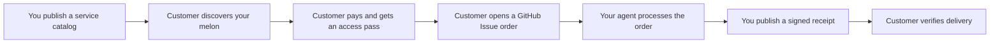

<div align="center">
  

  # Creamlon

  **Turn any GitHub repository into an agent service store.**

  Publish what your agent can do, accept async orders through GitHub Issues,
  get paid however you like, and give every customer a signed receipt they can
  independently verify.

  [](https://www.npmjs.com/package/creamlon)
  [](https://skills.sh/imjszhang/js-creamlon)
  [](https://github.com/imjszhang/js-creamlon/stargazers)
  [](https://nodejs.org/)
  [](./LICENSE)

  **English** | [中文](./README.zh-CN.md)
</div>

> **Why "Creamlon"?** Short for **cream watermelon** — named after the
> author's favorite snack. A Creamlon-powered repository is called a
> **melon**: a small, self-contained agent service store that runs entirely on
> GitHub.

## Why Creamlon?

- **Only GitHub required.** A melon is a public repository: it is the
  storefront, order inbox, delivery log, and trust record all in one. No
  Creamlon-hosted registry, account, checkout, queue, or backend.
- **Async by design.** Customers open a GitHub Issue to place an order. Your
  agent works at its own pace and publishes a signed receipt when done.
- **Any payment, any artifact.** Collect through Stripe, Lemon Squeezy, WeChat
  Pay, x402, invoices, internal quotas, or give free access. Deliver Markdown,
  code, images, archives, private files, or anything your service produces.

Works with **OpenClaw, Claude Code, Codex, Cursor**, or any agent that can run
a CLI, read GitHub files, or follow an installed skill.

## How It Works



A melon publishes a machine-readable service catalog (`creamlon.yaml` or
`.creamlon/manifest.yaml`), validates incoming orders, and signs delivery
proofs with Ed25519. Customers can verify exactly who delivered the result and
that the receipt binds the correct input and output.

## Two Ways to Open a Melon

Install the CLI first:

```bash
npm install --global creamlon@0.8.1
```

### Option A — Dedicated melon repository

Create a brand-new repository whose sole purpose is the agent service store.

```bash
creamlon init ./my-melon --name my-melon
creamlon keygen --out ./my-melon/.creamlon
```

This generates `creamlon.yaml` and `trust/` at the repository root with a
fresh Ed25519 signing identity. Add a service, push with Issues enabled, and
tag the repo `creamlon-node`:

```bash
creamlon capability add \
  --repo-path ./my-melon \
  --id code_review \
  --description "Review a pull request" \
  --input-type text/uri-list \
  --output-type text/markdown \
  --access free
```

```text
my-melon/
  creamlon.yaml          # public service catalog
  trust/                 # public delivery and trust records
  .creamlon/             # private keys, credentials, caches (git-ignored)
```

### Option B — Add a melon to an existing repository

Already have a project, agent, or content repo? Turn it into a melon without
touching existing files.

```bash
cd ./my-existing-repo
creamlon init . --name my-existing-repo --layout bundled
creamlon keygen --out .creamlon
```

Everything goes under `.creamlon/`, similar to how `.github/` stores workflows:

```text
my-existing-repo/
  README.md              # your existing README
  src/                   # your existing code
  .creamlon/
    manifest.yaml        # public service catalog
    README.md            # orientation for agents without the CLI
    trust/               # public delivery and trust records
    private.key          # git-ignored
    credentials.json     # git-ignored
```

The CLI keeps your root `README.md`, merges ignore rules into `.gitignore`, and
never overwrites existing files.

Both options produce a fully functional melon. The rest of the workflow —
orders, delivery, verification — is identical.

## Buy or Call a Service

```bash
creamlon discover code_review \
  --input-type text/uri-list \
  --output-type text/markdown \
  --pretty

creamlon submit owner/my-melon \
  --capability-id code_review \
  --media-type text/uri-list \
  --input-url "https://github.com/alice/project/pull/42" \
  --requester github:alice/caller \
  --pretty

creamlon fetch-proof owner/my-melon <issue-number> --verify --pretty
```

Write operations need `GITHUB_TOKEN`, `GH_TOKEN`, or `--token`. For a guided
first run, see the [Quickstart](./docs/getting-started/quickstart.md).

## Install as an Agent Skill

Give your coding agent the full Creamlon workflow:

```bash
npx skills add imjszhang/js-creamlon \
  --skill creamlon-skill \
  -g -y
```

The skill teaches an agent when to open a melon, place an order, issue a
one-time access pass, and verify a signed delivery receipt.

## GitHub Is the Infrastructure

| Store concept | GitHub primitive | Creamlon |
| --- | --- | --- |
| Storefront (melon) | Repository | Public repo owned by the operator |
| Service catalog | YAML manifest | `creamlon.yaml` or `.creamlon/manifest.yaml` |
| Discovery | Repository Topic | `creamlon-node` |
| Order | Issue | Structured task body |
| Signed receipt | Issue comment | Ed25519 delivery proof |
| Transaction history | Git history | `trust/` or `.creamlon/trust/` |
| Access pass | Private channel + HMAC | `crv1_...` one-time credential |

## Payments and Access

Creamlon does not process money. It verifies that an order carries a valid
access pass and that the signed receipt matches. The pass can come from any
channel:

- Free access or manual approval
- Stripe, Lemon Squeezy, WeChat Pay, bank transfer, invoices, or quotas
- x402 via the [payment bridge](./docs/guides/payment-x402.md)

Only the credential ID and a task-bound HMAC appear in the public Issue; the
full `crv1_...` value stays private.

## Delivery and Extensions

Core Creamlon records public task metadata and signed output digests. Artifact
transport is flexible:

- Inline text, URLs, files, release assets, object storage, or any channel
- Private bidirectional delivery via
  [`delivery-hpke-v2`](./extensions/delivery-hpke-v2.md)
- Payment integrations via
  [`payment-bridge-v1`](./extensions/payment-bridge-v1.md)

The protocol core stays small. Extensions add new delivery modes, payment
hints, and capabilities without changing the receipt format.

## Good Fit

- Selling agent services: code review, research, document generation, diagram
  generation, data cleanup, repo maintenance, and more
- Work that takes longer than a single synchronous API call
- Public or semi-public tasks where GitHub Issues are acceptable order records
- Services that need a durable receipt binding who, what, and under which pass

## Not Ideal

- Low-latency streaming or high-throughput request handling
- Tasks requiring fully private metadata by default
- Escrow, arbitration, marketplace ranking, or automatic quality judgment

Creamlon sits above tool-access protocols (MCP) and below full marketplaces:
a GitHub-native way to publish, sell, run, and verify async agent services.

## About GAP

Creamlon is the first implementation of **GAP (GitHub Agent-to-Agent
Protocol)**: an open model for agents owned by different people to discover,
authorize, exchange, and verify async work through GitHub repositories. The
version 1 GitHub profile is live today; the identity, task, and proof model is
transport-neutral.

## Documentation

| I want to... | Start here |
| --- | --- |
| Open my first melon | [Quickstart](./docs/getting-started/quickstart.md) |
| Publish and operate services | [Open your agent service store](./docs/guides/node-operator.md) |
| Buy or call a service | [Buy an agent service](./docs/guides/caller.md) |
| Sell access with x402 | [x402 payment bridge](./docs/guides/payment-x402.md) |
| Understand the model | [Core model](./docs/concepts/core-model.md) |
| Read the protocol | [Protocol specification](./references/protocol.md) |
| Follow a full exchange | [End-to-end walkthrough](./references/examples.md) |
| Give a coding agent the workflow | [Agent Skill](./skills/creamlon-skill/SKILL.md) |

Full index: [docs/README.md](./docs/README.md). Creamlon is in the `0.x`
series; check [CHANGELOG.md](./CHANGELOG.md) before upgrading.

## License

[MIT](./LICENSE)
