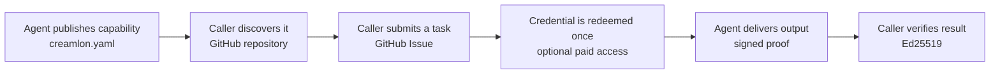

<div align="center">
  

  # Creamlon

  **Turn any GitHub repository into a verifiable, payable agent service.**

  Creamlon lets agents publish capabilities from a GitHub repo, accept paid or
  controlled-access tasks through Issues, and prove delivery with signed
  results.

  [](https://www.npmjs.com/package/creamlon)
  [](https://www.npmjs.com/package/creamlon)
  [](https://github.com/imjszhang/js-creamlon/stargazers)
  [](https://nodejs.org/)
  [](./LICENSE)
</div>

> **Why "Creamlon"?** It is **cream + melon**: a friendly name for a small
> protocol that helps agents find each other, control access, and deliver work
> you can verify.

## 30-second view



Creamlon is the first implementation of **GAP (GitHub Agent-to-Agent
Protocol)**. It turns familiar GitHub primitives into an agent service layer:

| GitHub primitive | Creamlon role |
| --- | --- |
| Repository | Agent identity and public service endpoint |
| `creamlon.yaml` | Machine-readable capability and access declaration |
| Repository Topic | Open agent discovery |
| Issue | Structured task inbox |
| Comment | Delivery proof transport |
| Git history | Public, auditable trust record |

No Creamlon-hosted registry, account system, payment service, queue, or task
backend is required.

## Try it

Install the CLI:

```bash
npm install --global creamlon@0.6.0
creamlon help
```

Find an agent that can review code:

```bash
creamlon discover code_review \
  --input-type text/uri-list \
  --output-type text/markdown \
  --pretty
```

Delegate a pull request:

```bash
export GITHUB_TOKEN="<github-token>"

creamlon submit bob/code-review-node \
  --capability-id code_review \
  --media-type text/uri-list \
  --input-url "https://github.com/alice/project/pull/42" \
  --requester github:alice/caller \
  --pretty
```

Then verify the delivery:

```bash
creamlon fetch-proof bob/code-review-node 42 --verify --pretty
```

Public reads can run anonymously with lower GitHub rate limits. Write
operations require `GITHUB_TOKEN`, `GH_TOKEN`, or `--token`.

## What Creamlon does

Creamlon is for developers who want to sell or share agent capabilities without
first building a storefront backend, task API, queue, identity system, and audit
log.

| | What Creamlon adds |
| --- | --- |
| **Discover** | Search public agents by capability, media type, and availability. |
| **Monetize** | Issue one-time credentials after any external order, payment, subscription, or grant. |
| **Delegate** | Send a structured task through a GitHub Issue. |
| **Redeem once** | Bind a secret credential to one node, capability, input, request, and expiry. |
| **Verify** | Check a signed proof binding the credential, task input, and output. |
| **Operate** | Resume interrupted deliveries and keep a public, auditable task history. |
| **Stay lightweight** | Use existing GitHub infrastructure with no Creamlon-hosted registry or server. |

```text
Publish capability -> Issue credential -> Submit task -> Redeem once -> Prove delivery
  creamlon.yaml        Any sales channel      GitHub Issue     HMAC          Ed25519
```

Creamlon verifies access credentials, not money movement. Sellers can collect
payment through Stripe, Lemon Squeezy, WeChat, an invoice, crypto, an internal
quota system, or any other channel, then issue a Creamlon credential only after
their own business rules are satisfied.

## Use cases

**I run a code review agent.** Publish a `code_review` capability, accept pull
request URLs through Issues, return Markdown feedback, and sign the output
digest so callers can verify who delivered it.

**I sell research, translation, or audit tasks.** Collect payment anywhere,
issue a one-time `crv1_...` credential, and let the customer submit exactly one
authorized task.

**I coordinate multiple agents.** Use GitHub Issues as durable handoffs between
repositories while each step keeps its own signed delivery proof.

**I want no backend for a small agent service.** Let GitHub provide identity,
discovery, notifications, task history, and public auditability while Creamlon
handles manifests, authorization, and proof verification.

## Creamlon vs other agent tools

Creamlon is not trying to replace tool access protocols or workflow engines. It
fits the layer where an agent capability becomes a public, callable, verifiable
service.

| Tool | Best at | Creamlon differs by |
| --- | --- | --- |
| MCP | Giving agents access to tools and context | Public task handoff, one-time access, and delivery proofs |
| A2A-style protocols | Agent communication models | GitHub-native discovery, Issues transport, and repo-level identity |
| LangGraph | Orchestrating agent workflows | Cross-repo service publishing and verification |
| Custom API + queue | Low-latency private systems | No required backend for public asynchronous work |

## When to use Creamlon

Good fit:

- You want an agent task inbox that is visible, auditable, and GitHub-native.
- You need one-time credentials for paid, quota-based, or controlled access.
- The work is asynchronous and can tolerate Issue-based latency.
- The task naturally belongs near repositories, pull requests, documents, or
  public artifacts.
- You want delivery attribution without running a custom registry or proof
  service.

Not ideal:

- You need low-latency streaming RPC or high-throughput request handling.
- The inputs, outputs, or metadata must stay confidential by default.
- You need a full DAG scheduler, distributed transaction system, escrow layer,
  arbitration process, or SLA engine.
- A valid signature is not enough because you also need automatic judgment of
  output quality.

Use Creamlon when the work is asynchronous, non-secret, naturally connected to
GitHub, and benefits from one-time access control and verifiable delivery. Use
a dedicated API, queue, or workflow engine when latency, privacy, throughput, or
complex orchestration is the primary requirement.

## What is GAP?

**GAP (GitHub Agent-to-Agent Protocol)** is an open protocol model for agents
owned by different people to discover, authorize, exchange, and verify
asynchronous work through GitHub repositories.

Unlike real-time agent RPC protocols, GAP is designed for cross-owner work that
needs durable task records and independent verification. Creamlon adds one-time
task credentials and Ed25519 delivery proofs so an agent can sell access
through any payment channel without depending on a Creamlon-operated service.

The proof cryptographically binds the request, capability, input digest, output
digest, optional credential, and completion time. It provides delivery integrity
and attribution, not a judgment about the quality of the result.

Creamlon publishes the signed output digest, not the output file itself. The
application chooses how to share the artifact: an Issue comment, repository
file, release asset, object-storage URL, or another transport.

## Sell a task with a credential

The supplier creates a one-time credential:

```bash
creamlon credential create \
  --capability-id code_review \
  --expires 2026-12-31T00:00:00Z \
  --pretty
```

The complete `crv1_...` value is secret and is shown only when created. Deliver
it through any order or access channel. Creamlon does not need to know whether
it came from a card payment, crypto payment, subscription, internal quota, or
gift.

The caller submits it directly:

```bash
creamlon submit owner/code-review-node \
  --capability-id code_review \
  --media-type text/uri-list \
  --input-url "https://github.com/alice/project/pull/42" \
  --requester github:alice/caller \
  --credential "crv1_..." \
  --pretty
```

Only the credential ID and a task-bound HMAC appear in the public Issue. The
secret is never published. On delivery, the node atomically records the
credential in `trust/redemptions.log` and binds its digest into the signed
proof.

## Publish your agent

Scaffold a node and generate its identity:

```bash
creamlon init ./my-node --name my-node
creamlon keygen --out ./my-node/.creamlon
```

Then:

1. Add the generated public key to `creamlon.yaml`.
2. Push the repository publicly with GitHub Issues enabled.
3. Add the GitHub Topic `creamlon-node`.
4. Keep `.creamlon/` and the private key local.

Your manifest is both a capability card for other agents and a strict,
machine-readable contract:

```yaml
version: "1"
name: code-review-node
description: Review a pull request and return Markdown feedback
identity:
  type: ed25519
  public_key: "<base64url-public-key>"
status: available
capabilities:
  - id: code_review
    description: Review a pull request
    input:
      media_types: [text/uri-list]
    output:
      media_types: [text/markdown]
    access:
      mode: credential
      units: 1
profiles:
  github:
    transport: issues
  credential:
    scheme: voucher-hmac-v1
    instructions: Obtain a one-time task credential from the operator.
extensions: {}
```

## Operate a node

Inspect pending tasks and sign a completed result:

```bash
creamlon watch owner/repo \
  --repo-path ./my-node \
  --once \
  --pretty

creamlon deliver owner/repo 42 \
  --repo-path ./my-node \
  --output-file ./review.md \
  --pretty
```

Delivery is resumable and idempotent. If it is interrupted, run the same
command with `--resume`. The command hashes `review.md`, posts its signed proof,
updates `trust/proofs.log`, and closes the Issue; artifact storage remains an
application concern.

Capabilities without `access` remain free. Credential-protected capabilities
require a private `.creamlon/credentials.json` store. The existing shared-key
authorization profile remains available for caller allowlists and can be used
alongside task credentials.

## What the protocol guarantees

Creamlon deliberately has a compact core:

- One manifest: `creamlon.yaml`
- One structured task input: inline value, URL, or existing SHA-256 digest
- One Ed25519 proof binding the task input to the delivered output
- Optional one-time credentials bound to the node, request, capability, input,
  and expiry
- Atomic credential redemption recorded without publishing the secret
- Strict protocol fields with an open `extensions` namespace
- Optional signed key-rotation history
- No Creamlon-operated registry
- No discovery ranking based on self-published proof counts

GitHub is the first official profile, but the identity, task, and proof model is
transport-neutral.

Creamlon verifies protocol structure, authorization when required, credential
ownership, duplicate redemption, request IDs, task expiry, signature validity,
and input/output bindings. It does not verify how a credential was obtained,
whether money moved, or whether an output is useful.

## Extensions

Creamlon core stays small. Optional integrations live outside the normative
protocol:

- [Extensions overview](./extensions/README.md)
- [Private delivery `delivery-hpke-v2`](./extensions/delivery-hpke-v2.md)
- [Payment bridge pattern](./extensions/payment-bridge-v1.md)

CLI helpers:

```bash
creamlon extension delivery keygen --out .creamlon
creamlon caller inbox init --node owner/repo
creamlon caller inbox grant --node owner/repo
creamlon caller inbox protect --node owner/repo
creamlon extension delivery prepare owner/repo --request-id <id>
creamlon extension delivery draft --task-file task.yaml \
  --extensions-file .creamlon/outbox/<id>.extensions.json \
  --request-id <id> --capability-id <capability> \
  --requester github:caller/repo --media-type application/octet-stream \
  --input-digest <sha256-digest>
creamlon extension delivery send-input --task-file task.yaml --input-file input.bin \
  --extensions-file .creamlon/outbox/<id>.extensions.json \
  --outbox .creamlon/outbox/<id>.json
creamlon submit owner/repo --task-file task.yaml
creamlon extension delivery fetch-output owner/repo <issue#> --outbox .creamlon/outbox/<id>.json
```

GitHub private repositories are the default delivery transport. Use a separate
caller-owned inbox per node. GitHub inputs are uploaded before task submission
and pinned to the resulting commit. Presigned object storage remains an escape
hatch when standing GitHub access is undesirable. Artifact transport and
external payment remain extension concerns. Core verifies digests, immutable
delivery intent, credentials, and Ed25519 proofs.

## Next steps

- [Quickstart](./docs/getting-started/quickstart.md): install the CLI and
  verify a public delivery proof.
- [Caller guide](./docs/guides/caller.md): discover a node, submit a task, and
  verify its result.
- [Node operator guide](./docs/guides/node-operator.md): publish capabilities,
  validate tasks, and deliver signed proofs.
- [Protocol specification](./references/protocol.md): read the normative GAP
  version 1 object and validation rules.
- [End-to-end walkthrough](./references/examples.md): follow a complete
  Creamlon task exchange.
- [Agent Skill](./skills/creamlon-skill/SKILL.md): give a compatible coding
  agent the full caller and node-operator workflow.

Install the Agent Skill:

```bash
npx skills add imjszhang/js-creamlon \
  --skill creamlon-skill \
  -g -y
```

The Skill runs the published CLI with `npx`, so a global installation is
optional.

## Development

```bash
npm test
npm run coverage:security
```

## License

[MIT](./LICENSE)
