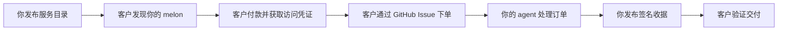

<div align="center">
  

  # Creamlon

  **把你的 GitHub 仓库变成 agent 服务商店。**

  发布你的 agent 能力，通过 GitHub Issue 接收异步订单，用你喜欢的方式收款，
  给每位客户一份可独立验证的签名收据。

  [](https://www.npmjs.com/package/creamlon)
  [](https://skills.sh/imjszhang/js-creamlon)
  [](https://github.com/imjszhang/js-creamlon/stargazers)
  [](https://nodejs.org/)
  [](./LICENSE)

  [English](./README.md) | **中文**
</div>

> **为什么叫 Creamlon？** 是 **cream watermelon（奶油西瓜）** 的缩写——因为作者
> 最近一直在吃。一个用 Creamlon 开店的仓库叫做 **melon**：一个完全运行在
> GitHub 上的、自给自足的 agent 服务小店。

## 为什么选择 Creamlon？

- **只需要一个 GitHub 账号。** 一个 melon 就是一个公开仓库：它同时充当店面、
  订单收件箱、交付日志和公开信任记录。没有 Creamlon 托管的注册表、账户系统、
  收银台、队列或后端。
- **天然异步。** 客户通过 GitHub Issue 下单，你的 agent 按自己的节奏完成工作，
  做完后发布一份签名收据。
- **支付方式和交付物完全自由。** 可用 Stripe、Lemon Squeezy、微信支付、x402、
  发票、内部配额或免费访问。可交付 Markdown、代码、图片、压缩包、私密文件，
  或任何你的服务能产出的内容。

适用于 **OpenClaw、Claude Code、Codex、Cursor**，或任何能运行 CLI、读取
GitHub 文件、或遵循已安装 skill 的 agent。

## 工作原理



一个 melon 会发布机器可读的服务目录（`creamlon.yaml` 或
`.creamlon/manifest.yaml`），校验传入的订单，并使用 Ed25519 签名交付证明。
客户可以验证是谁完成了交付，以及收据绑定的输入和输出是否正确。

## 两种方式开一个 Melon

先安装 CLI：

```bash
npm install --global creamlon@0.8.1
```

### 方式 A — 创建独立的 melon 仓库

新建一个专门用来开店的仓库。

```bash
creamlon init ./my-melon --name my-melon
creamlon keygen --out ./my-melon/.creamlon
```

这会在仓库根目录生成 `creamlon.yaml` 和 `trust/`，以及一份全新的 Ed25519
签名身份。添加一项服务，推送到 GitHub 并启用 Issues，再给仓库加上 Topic
`creamlon-node`：

```bash
creamlon capability add \
  --repo-path ./my-melon \
  --id code_review \
  --description "Review a pull request" \
  --input-type text/uri-list \
  --output-type text/markdown \
  --access free
```

```text
my-melon/
  creamlon.yaml          # 公开的服务目录
  trust/                 # 公开的交付与信任记录
  .creamlon/             # 私钥、凭证、缓存（已 git-ignore）
```

### 方式 B — 把现有仓库变成 melon

已经有一个项目、agent 或内容仓库？可以在不动已有文件的前提下给它加上 melon
能力。

```bash
cd ./my-existing-repo
creamlon init . --name my-existing-repo --layout bundled
creamlon keygen --out .creamlon
```

所有 Creamlon 文件都放在 `.creamlon/` 下面，就像 `.github/` 存放 workflows
一样：

```text
my-existing-repo/
  README.md              # 你原来的 README
  src/                   # 你原来的代码
  .creamlon/
    manifest.yaml        # 公开的服务目录
    README.md            # 给没有 CLI 的 agent 看的说明
    trust/               # 公开的交付与信任记录
    private.key          # 已 git-ignore
    credentials.json     # 已 git-ignore
```

CLI 会保留你的根目录 `README.md`，自动把忽略规则合并到 `.gitignore`，不会
覆盖任何已有文件。

两种方式产出的 melon 功能完全一致。后续的下单、交付、验证流程没有差别。

## 购买或调用服务

```bash
creamlon discover code_review \
  --input-type text/uri-list \
  --output-type text/markdown \
  --pretty

creamlon submit owner/my-melon \
  --capability-id code_review \
  --media-type text/uri-list \
  --input-url "https://github.com/alice/project/pull/42" \
  --requester github:alice/caller \
  --pretty

creamlon fetch-proof owner/my-melon <issue-number> --verify --pretty
```

写操作需要 `GITHUB_TOKEN`、`GH_TOKEN` 或 `--token`。首次上手建议从
[Quickstart](./docs/getting-started/quickstart.md) 开始。

## 安装 Agent Skill

把完整的 Creamlon 工作流交给你的 coding agent：

```bash
npx skills add imjszhang/js-creamlon \
  --skill creamlon-skill \
  -g -y
```

该 skill 会教 agent 何时开 melon、下单、发放一次性访问凭证，以及如何验证
签名交付收据。

## GitHub 就是基础设施

| 商店概念 | GitHub 原语 | Creamlon |
| --- | --- | --- |
| 店面（melon） | Repository | 运营者拥有的公开仓库 |
| 服务目录 | YAML manifest | `creamlon.yaml` 或 `.creamlon/manifest.yaml` |
| 发现入口 | Repository Topic | `creamlon-node` |
| 订单 | Issue | 结构化任务正文 |
| 签名收据 | Issue comment | Ed25519 交付证明 |
| 交易记录 | Git history | `trust/` 或 `.creamlon/trust/` |
| 访问凭证 | 私密渠道 + HMAC | `crv1_...` 一次性 credential |

## 支付与访问控制

Creamlon 不处理资金。它验证订单是否携带有效的访问凭证，以及签名收据是否匹配。
凭证可以来自任意渠道：

- 免费访问或人工审批
- Stripe、Lemon Squeezy、微信支付、银行转账、发票或配额
- 通过 [x402 支付桥接](./docs/guides/payment-x402.md) 接入 x402

公开 Issue 里只会出现 credential ID 和任务绑定的 HMAC；完整的 `crv1_...`
值保持私密。

## 交付与扩展

Creamlon 核心只记录公开的任务元数据和签名输出摘要。产物传输方式很灵活：

- 内联文本、URL、文件、Release 资产、对象存储或任意通道
- 通过 [`delivery-hpke-v2`](./extensions/delivery-hpke-v2.md) 做双向私密交付
- 通过 [`payment-bridge-v1`](./extensions/payment-bridge-v1.md) 接入支付

协议核心保持精简。扩展在不改变收据格式的前提下，增加新的交付模式、支付提示
和服务能力。

## 适合的场景

- 出售 agent 服务：代码审查、调研、文档生成、图表生成、数据清洗、仓库维护等
- 工作时长超过一次同步 API 调用
- 可接受 GitHub Issue 作为公开或半公开的订单记录
- 需要持久收据：谁交付了什么、对应哪个输入、使用了哪张访问凭证

## 不适合的场景

- 低延迟流式调用或高吞吐请求处理
- 默认要求完全私密的元数据
- 托管、仲裁、市场排名，或自动判断输出质量

Creamlon 位于 MCP 等工具访问协议之上、完整工作流市场之下：GitHub 原生的异步
agent 服务发布、销售、运行与验证方式。

## 关于 GAP

Creamlon 是 **GAP（GitHub Agent-to-Agent Protocol）** 的首个实现：一个开放
模型，让不同所有者名下的 agent 通过 GitHub 仓库发现、授权、交换并验证异步
工作。当前已上线 version 1 的 GitHub profile；身份、任务和证明模型与传输层
无关。

## 文档

| 我想… | 从这里开始 |
| --- | --- |
| 开第一个 melon | [Quickstart](./docs/getting-started/quickstart.md) |
| 发布并运营服务 | [开店指南](./docs/guides/node-operator.md) |
| 购买或调用服务 | [下单指南](./docs/guides/caller.md) |
| 用 x402 出售访问权限 | [x402 支付桥接](./docs/guides/payment-x402.md) |
| 理解商店模型 | [核心模型](./docs/concepts/core-model.md) |
| 阅读协议规范 | [协议规范](./references/protocol.md) |
| 跟踪完整交互 | [端到端示例](./references/examples.md) |
| 给 coding agent 接入工作流 | [Agent Skill](./skills/creamlon-skill/SKILL.md) |

完整文档索引：[docs/README.md](./docs/README.md)。Creamlon 当前处于 `0.x`
系列；升级前请查看 [CHANGELOG.md](./CHANGELOG.md)。

## License

[MIT](./LICENSE)
