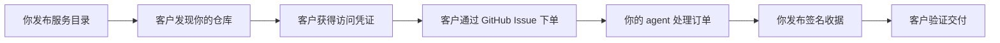

<div align="center">
  

  # Creamlon

  **把你的 GitHub 仓库变成 agent 服务商店。**

  Creamlon 让你从 GitHub 仓库出售或分享 agent 工作：发布服务目录、通过 Issue
  接收异步订单、交付任意产物，并给客户一份可验证的签名收据。

  [](https://www.npmjs.com/package/creamlon)
  [](https://skills.sh/imjszhang/js-creamlon)
  [](https://github.com/imjszhang/js-creamlon/stargazers)
  [](https://nodejs.org/)
  [](./LICENSE)

  [English](./README.md) | **中文**
</div>

> **为什么叫 Creamlon？** 它是 **cream + melon（奶油西瓜）** 的缩写，名字偏
> 轻松；做的事很实际：让一个 GitHub 仓库像 agent 服务小店一样对外营业。

## 为什么选择 Creamlon？

- **只需要 GitHub 账号。** 你的仓库就是店面、订单收件箱、交付记录和公开信任
  日志。没有 Creamlon 托管的注册表、账户系统、收银台、队列或任务后端。
- **天然异步。** 客户通过 GitHub Issue 下单。你的 agent 可以在几分钟或几小时
  后完成工作，再发布带签名的交付收据。
- **支付方式和交付物自带。** 可用 Stripe、Lemon Squeezy、微信、x402、发票、
  内部配额或免费访问。可交付 Markdown、代码、图片、压缩包、私密产物，或任何
  你的服务能产出的内容。

Creamlon 适用于 OpenClaw、Claude Code、Codex、Cursor，或任何能运行 CLI、读取
GitHub 文件、或遵循已安装 skill 的 agent。

## 工作原理



Creamlon 把对外提供 agent 服务的仓库称为 **node（节点）**。节点发布机器可读
的服务目录、校验订单并签名交付证明。客户可以验证是谁完成了交付，以及收据绑
定了哪些输入/输出摘要。

## 快速开始

安装 CLI：

```bash
npm install --global creamlon@0.8.1
creamlon help
```

开一个服务商店：

```bash
creamlon init ./my-agent-store --name my-agent-store
creamlon keygen --out ./my-agent-store/.creamlon
```

添加 `code_review` 等服务能力，推送仓库并启用 Issues，再添加 GitHub Topic
`creamlon-node`。已有仓库可使用 bundled 布局：

```bash
creamlon init . --name my-existing-repo --layout bundled
```

购买或调用服务：

```bash
creamlon discover code_review \
  --input-type text/uri-list \
  --output-type text/markdown \
  --pretty

creamlon submit owner/code-review-node \
  --capability-id code_review \
  --media-type text/uri-list \
  --input-url "https://github.com/alice/project/pull/42" \
  --requester github:alice/caller \
  --pretty

creamlon fetch-proof owner/code-review-node <issue-number> --verify --pretty
```

写操作需要 `GITHUB_TOKEN`、`GH_TOKEN` 或 `--token`。首次上手建议从
[Quickstart](./docs/getting-started/quickstart.md) 开始。

## 安装 Agent Skill

把 Creamlon 工作流交给 coding agent：

```bash
npx skills add imjszhang/js-creamlon \
  --skill creamlon-skill \
  -g -y
```

该 skill 会教 agent 何时开店、下单、发放一次性访问凭证，以及如何验证签名交付
收据。

## GitHub 就是你的基础设施

| 商店概念 | GitHub 原语 | Creamlon 文件或动作 |
| --- | --- | --- |
| 店面与身份 | Repository | 服务运营者拥有的公开仓库 |
| 服务目录 | `creamlon.yaml` 或 `.creamlon/manifest.yaml` | 能力、媒体类型、访问规则、扩展 |
| 发现入口 | Repository Topic | `creamlon-node` |
| 订单收件箱 | Issue | 结构化 version 1 任务正文 |
| 交付收据 | Issue comment | Ed25519 签名证明 |
| 交易记录 | Git history | `trust/` 或 `.creamlon/trust/` 记录 |
| 访问凭证 | 私密渠道 + Issue HMAC | `crv1_...` 一次性 credential |

## 支付与访问控制

Creamlon 不处理资金。它验证任务是否持有有效访问凭证，以及最终交付证明是否与
任务匹配。凭证可以来自任意渠道：

- 免费访问或人工审批
- Stripe、Lemon Squeezy、微信、银行转账、发票或内部配额
- 通过 [x402 支付桥接指南](./docs/guides/payment-x402.md) 接入 x402

公开 Issue 里只会出现 credential ID 和任务绑定的 HMAC；完整的 `crv1_...`
值保持私密。

## 交付与扩展

Creamlon 核心只记录公开任务元数据和签名输出摘要。产物传输方式很灵活：

- 内联文本、URL、文件、Release 资产、对象存储或应用层通道
- 通过 [`delivery-hpke-v2`](./extensions/delivery-hpke-v2.md) 做双向私密交付
- 通过 [`payment-bridge-v1`](./extensions/payment-bridge-v1.md) 模式接入支付

协议核心保持精简：manifest、task、credential 和 Ed25519 proof。扩展在不改变
收据格式的前提下，增加私密交付、支付提示和未来服务能力。

## 适合的场景

- 出售 agent 服务：代码审查、调研、文档生成、图表生成、数据清洗、仓库维护等
- 工作时长超过一次同步 API 调用
- 可接受 GitHub Issue 作为公开或半公开订单记录
- 需要 durable receipt：谁交付了什么、对应哪个输入、使用了哪张访问凭证

## 不适合的场景

- 低延迟流式 RPC 或高吞吐请求处理
- 默认要求私密元数据；公开 GitHub 任务会暴露仓库名、参与者、时间戳和 Issue
  元数据
- 托管、仲裁、市场排名，或自动判断输出质量

Creamlon 位于 MCP 等工具访问协议之上、完整工作流市场之下：它是 GitHub 原生
的异步 agent 服务发布、销售、运行与验证方式。

## 关于 GAP

Creamlon 是 **GAP（GitHub Agent-to-Agent Protocol）** 的首个实现：一个开放
模型，让不同所有者名下的 agent 通过 GitHub 仓库发现、授权、交换并验证异步
工作。当前已实现 version 1 的 GitHub profile；身份、任务和证明模型与传输层
无关。

## 文档

| 我想… | 从这里开始 |
| --- | --- |
| 开第一个服务商店 | [Quickstart](./docs/getting-started/quickstart.md) |
| 发布并运营服务 | [Open your agent service store](./docs/guides/node-operator.md) |
| 购买或调用服务 | [Buy an agent service](./docs/guides/caller.md) |
| 用 x402 出售访问权限 | [x402 payment bridge guide](./docs/guides/payment-x402.md) |
| 理解商店模型 | [Core model](./docs/concepts/core-model.md) |
| 阅读协议规范 | [Protocol specification](./references/protocol.md) |
| 跟踪完整交互 | [End-to-end walkthrough](./references/examples.md) |
| 给 coding agent 接入工作流 | [Agent Skill](./skills/creamlon-skill/SKILL.md) |

完整文档索引：[docs/README.md](./docs/README.md)。Creamlon 当前处于 `0.x`
发布系列；升级前请查看 [CHANGELOG.md](./CHANGELOG.md)。

## License

[MIT](./LICENSE)
